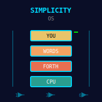

<div align="center">

[](img/simplicity_logo.svg)

# Simplicity OS

[](LICENSE)
[](https://en.wikipedia.org/wiki/X86-64)
[](https://www.nasm.us/)
[](CHANGELOG.md)
[](#)

Bare-metal x86_64 operating system built on Forth principles.

**Blog post**: [Building a 64-bit OS from Scratch with Claude Code](https://isene.org/2025/11/SimplicityOS.html)
**Development narrative**: [MakingAnOS.md](MakingAnOS.md) - Complete session transcript

</div>

## Philosophy

Everything is a WORD. Hardware is directly composable via stack-based interface.

## Quick Start

```bash
# Build the OS
make

# Run in QEMU
make run

# Debug with GDB
make debug
```

## Requirements

- NASM (assembler)
- QEMU (emulator)
- GCC/LD (linker)
- Make

## Project Structure

```
/boot      - Bootloader and early initialization
/kernel    - Forth kernel core
/drivers   - Hardware drivers as Forth WORDs
/stdlib    - Standard Forth word library
/tools     - Build and development utilities
/docs      - Technical documentation
```

## Current Status

**Complete Interactive Forth OS**

- Fully interactive Forth shell
- PS/2 keyboard with shift support
- **Colon definitions** - Define new words, including nested
- **Variables** - Allocated storage
- **Comments** - ( text ) for documentation
- **Strings** - "text" auto-prints, works in definitions
- **Introspection** - words, see, forget
- **Arrays** - `{ 1 2 3 }` literal syntax with nested support
- **Type introspection** - `type` and `len` words
- **User-defined types** - Build custom types from primitives
- **Built-in words**: + - * / . .s dup drop swap rot over @ ! emit cr len type type-new type-name type-set type-name?
- Dictionary with linked list
- Case-insensitive
- ~11KB total

**Pure Data Architecture - Only `.` Prints:**
```forth
> "Test"
ok (STRING object pushed, no output)
> .
Test ok (. detects STRING and prints)

> 2 3 +
ok (5 pushed as immediate)
> .
5 ok (. prints number)

> : square dup * ;
ok
> : square4 square square ;
ok (nested definitions)
> 2 square4 .
256 ok (2^8)

> ~square ?
ok (pushes STRING "(colon)")
> .
(colon) ok (. prints it)

> variable x
ok
> 100 x ! x @ .
100 ok

> "Hello" "World" . .
WorldHello ok (LIFO stack order)

> words
ok (pushes STRING list)
> .
square4 square x + - * / ... ok

> { 1 2 3 }
ok (ARRAY object pushed)
> len .
3 ok
> type .
3 ok (type 3 = ARRAY)

> { "hello" { 1 2 } 42 }
ok (nested array with string, array, int)
> .s
<1> [ARRAY:3] ok (type-aware stack display)

> type-new
ok (allocates type 4)
> .
4 ok

> "point" 4 type-name
ok (names type 4 as "point")

> { 10 20 } 4 type-set
ok (creates point from array)
> .
[point: 10 20 ] ok (displays with type name)

> 4 type-name? .
point ok (retrieves type name)
```

**Building a Complete Type System:**
```forth
( Define a 2D point type )
> type-new
ok
> .
4 ok
> "point" 4 type-name
ok

( Create point constructor )
> : point { rot rot } 4 type-set ;
ok

( Use it )
> 100 200 point
ok
> .
[point: 100 200 ] ok

( Define a rectangle using two points )
> type-new
ok
> "rect" 5 type-name
ok
> : rect { rot rot } 5 type-set ;
ok

( Create rectangle from two points )
> 0 0 point 100 50 point rect
ok
> .
[rect: . . ] ok (contains two point objects)
```

**Key Principle**: Nothing prints except `.`
All operations push data. `.` detects type and renders.

Self-modifying language with pure data semantics.

See CHANGELOG.md for complete feature list.

## Documentation

- `CLAUDE.md` - Project directives and conventions
- `PLAN.md` - Implementation plan and technical decisions
- `docs/` - Detailed technical documentation

## License

Public domain. Use freely.
