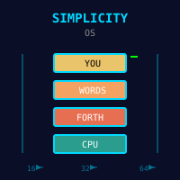

<div align="center">

[](img/simplicity_logo.svg)

# Simplicity OS

[](LICENSE)
[](https://en.wikipedia.org/wiki/X86-64)
[](https://www.nasm.us/)
[](CHANGELOG.md)

**Bare-metal x86_64 operating system built on pure RPN principles.**

Everything is a WORD. Hardware is directly composable.

[Blog Post](https://isene.org/2025/11/SimplicityOS.html) |
[Development Narrative](MakingAnOS.md) |
[Word Reference](docs/WORDS.md)

</div>

## Quick Start

```bash
make          # Build the OS
make run      # Run in QEMU, BIOS boot (requires QEMU installed)
make run-uefi # Run in QEMU, UEFI boot (requires OVMF firmware)
make debug    # Run with GDB debugging
```

The same kernel boots both ways. The UEFI loader (`boot/uefi.asm`) is a
hand-built PE32+ application that embeds the kernel, exits boot services,
programs VGA text mode directly (no BIOS), and jumps to it.

## Philosophy

Simplicity OS is built on three tiers of words:

1. **Kernel Words** - Written in x86_64 assembly, provide core primitives
2. **Core Words** - Written in RPN, extend the language
3. **User Words** - Applications and user-defined words

All operations use Reverse Polish Notation (RPN):
```forth
> 3 4 + .
7 ok

> "Hello World" .
Hello World ok
```

## Examples

### Stack Operations
```forth
> 5 dup .s
<2> 5 5 ok

> drop .s
<1> 5 ok

> 3 swap .s
<2> 3 5 ok

> + .
8 ok
```

### Defining New Words
```forth
> "square" [ dup * ] define
ok

> 7 square .
49 ok

> "cube" [ dup square * ] define
ok

> 3 cube .
27 ok
```

### Variables
```forth
> 0 {counter} !
ok

> {counter} @ .
0 ok

> 42 {counter} !
ok

> {counter} @ .
42 ok
```

### Control Flow
```forth
> "abs" [ dup 0 < if 0 swap - then ] define
ok

> -5 abs .
5 ok

> "countdown" [ begin dup . cr 1 - dup 0 = until drop ] define
ok

> 5 countdown
5
4
3
2
1
ok
```

### Arrays and Types
```forth
> 3 array {a} !
ok

> 10 {a} @ 0 put  20 {a} @ 1 put  30 {a} @ 2 put
ok

> {a} @ 1 at .
20 ok

> type-new .
4 ok

> "point" 4 type-name
ok

> "point" [ {p-y} ! {p-x} ! 2 array {p} !
    {p-x} @ {p} @ 0 put  {p-y} @ {p} @ 1 put
    {p} @ 4 type-set ] define
ok

> 100 200 point .
[point: 100 200 ] ok
```

### Built-in Editor

Launch the vim-style editor:
```forth
> 0 editor           ( new empty buffer )
> "myfile" editor    ( load existing file )
```

**Editor Commands:**
- **Normal mode**: `h/j/k/l` or arrows to move, `i` for insert, `:` for command
- **Insert mode**: Type text, `Ctrl+C` or `ESC` returns to normal
- **Command mode**: `:w filename` save, `:q` quit, `:wq` save and quit

### Disk Operations
```forth
> 512 allot {mybuf} !
ok

> 100 {mybuf} @ disk-read    ( read sector 100 )
ok

> {mybuf} @ 100 disk-write   ( write to sector 100 )
ok
```

### XRPN (HP-41 calculator layer)

```forth
> xrpn          ( interactive calculator: type FOCAL directly )
x: 0.0000
5
x: 5.0000
3
x: 3.0000
sqrt
x: 1.7321
q

> xrpn-init
> 10.0 xn fact
3628800.0000
```

Floats, the four-register X/Y/Z/T stack, 100 registers, flags and
FOCAL-style programs. Write programs as `.xrpn` files in `apps/`;
`tools/xrpn2forth` translates them to words at build time.

Programs can also be written on the OS itself: create a file in the
editor using hp-words, save with `:w name`, run with `"name" runfile`.
The kernel word `eval` interprets any string as source. All 274 XRPN
commands are traversed in [docs/XRPN-COVERAGE.md](docs/XRPN-COVERAGE.md):
154 implemented, the rest skipped for a named reason.

### UAC (Ultimate Alarm Clock)

```forth
> uac
```

Live clock, alarms (set at HH.MM, in 8h, in 30m), snooze, audible
time and a ring that will not stop until answered. The clock idles
with the CPU halted between timer ticks.

### Space Invaders

```forth
> invaders
```

18 aliens in 3 rows, alien bombs, 3 lives, levels that speed up.
`h`/`l` or arrows move, `x` or space fires, `q` quits.

## Word Categories

See [docs/WORDS.md](docs/WORDS.md) for complete reference.

### Kernel Words (Assembly)
Core primitives: `+ - * / mod dup drop swap . .s @ ! if then else begin while repeat`

### Core Words (RPN)
Extended operations loaded at boot time.

### User Words (Apps)
Applications like `editor`, `invaders`, `xrpn`, `uac`.

## Architecture

```
Kernel Words (Assembly)     <- Hardware interface, stack ops, control flow
        |
Core Words (RPN)            <- Higher-level operations
        |
User Words (Apps)           <- Applications, user definitions
```

**Memory Model:**
- Heap starts at 2MB, grows upward
- Stack uses R14 (TOS) + R15 (stack pointer)
- Dictionary uses linked list

**Type System:**
| Type | Value | Description |
|------|-------|-------------|
| INT | 0 | Immediate integers |
| STRING | 1 | Null-terminated text |
| REF | 2 | Word reference (execution token) |
| ARRAY | 3 | Counted array of values |
| USER | 4+ | User-defined types |

## Project Structure

```
/boot      - Bootloader (512 bytes) and stage2
/kernel    - x86_64 assembly kernel (~56KB)
/apps      - Applications in RPN (editor, games)
/tools     - Build utilities
/docs      - Technical documentation
```

## Real Hardware

The reliable route is BIOS boot from a USB stick:

```bash
make install    # interactive: picks the USB device, writes the image
```

- Needs a BIOS (or UEFI with CSM) that boots USB in HDD mode with
  LBA reads, and USB legacy keyboard support. Both are near-universal.
- The bootloader copies the apps into a RAM disk, so everything works
  without an ATA disk. A 64-bit CPU is checked at boot.
- Writes (save, editor files) persist only when a real ATA/IDE disk
  responds on the primary channel; otherwise they last until reboot.

UEFI boot on real hardware:

```bash
make uefi       # builds build/esp/EFI/BOOT/BOOTX64.EFI
```

Copy the `esp` directory contents to a FAT32 USB stick and boot it.
Works when the GPU still decodes legacy VGA and the keyboard is PS/2
(most laptops' internal keyboards are). Machines without VGA
compatibility show nothing; use the BIOS route there.

## Requirements

- NASM (assembler)
- QEMU (emulator)
- GNU Make
- For `make run-uefi`: OVMF firmware (`/usr/share/ovmf/OVMF.fd`) and a
  PSF1 console font for the loader's embedded VGA font (optional)

## Documentation

- [WORDS.md](docs/WORDS.md) - Complete word reference
- [ARCHITECTURE.md](docs/ARCHITECTURE.md) - Technical architecture
- [RPN-GUIDE.md](docs/RPN-GUIDE.md) - RPN programming guide
- [CLAUDE.md](CLAUDE.md) - Development conventions

## License

Public domain. Use freely.
